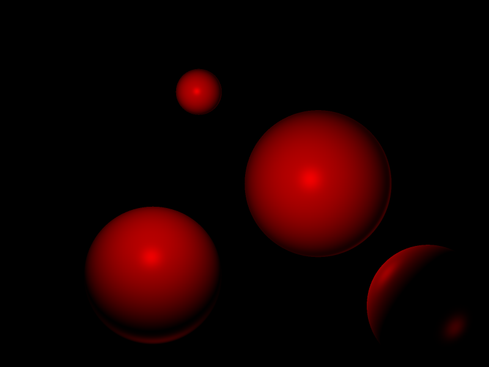

# yogort

Yet anOther GO Ray Tracer

----

Another old weekend project, just for the sake of it. Putting it on GitHub for archival purposes.

Doesn't do much in its current state but render some spheres with a primitive phong lighting model.

## Usage

Simply run the main executable from the project root directory. If successful, this will produce an image named `out.png`.

    $ go run cmd/yogort-render/main.go